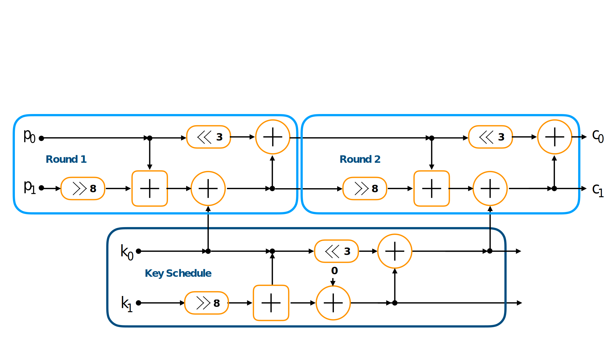
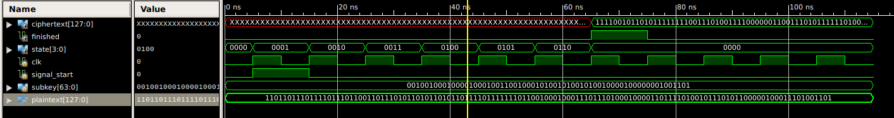
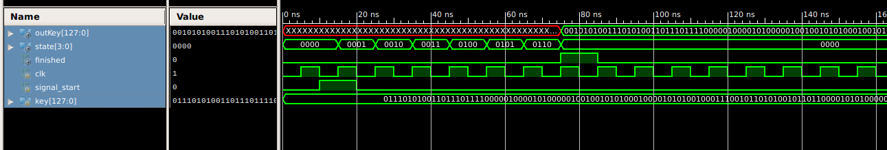
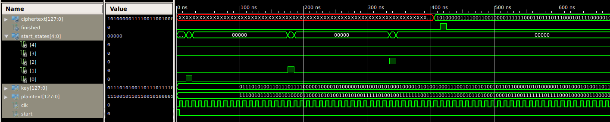

# Speck Cipher Veriog implementation

This repository contains a sample implementation of the SPECK64/128 cipher. 
See [Reference](https://csrc.nist.gov/csrc/media/events/lightweight-cryptography-workshop-2015/documents/papers/session1-shors-paper.pdf).

The cipher is using only ARX (Addition, Rotation and XOR) operations, which can be implemented fast in hardware as well as fast in hardware. 
The cipher can be implemented using two repeating blocks, the key schedule as well as the round function.
Like visualized in the figure below.

The verilog implementation follows this scheme and is subdivided into three verilog modules.

### 1. Round function

The round function is implemented as a state machine. 
In the following figure the different states of the SPECK verilog implementation can be seen.

#### State:

- 0000: Wait for start signal to start the round function 
- 0001: Assign p0 and p1 to dedicated registers
- 0010: Calculate right shift (>> 8) on p1
- 0011: Calculate p0 + p1
- 0100: Calculate left shift (<< 3) on p0 and p1 XOR subkey k0
- 0101: Calculate p0 = p0 + p1
- 0110: Assign result to ciphertext wire and indicate round finished by setting finished to high

### Key schedule

The key schedule implementation is also part of a dedicated verilog module. 
It is implemented as state machine similar to the round function. 

</img>

#### State:

- 0000: Wait for start signal to start the key schedule function 
- 0001: Assign k0 and k1 to dedicated registers
- 0010: Calculate right shift (>> 8) on k1
- 0011: Calculate k1 + k2
- 0100: calculate k1 = k1 XOR vector and left shift of k0 (<< 3)
- 0101: Calculate XOR of k1 and k2
- 0110: Assign result to new key indicate key schedule finished by setting finished wire to high

### Cipher control module

This module is responsible to control the round function and key schedule modules 
to execute three rounds of the SPECK64/128 cipher. 
It sets the signal_start signals and waits for a round function or key schedule to be finished. 

The simulation above shows the execution of three rounds of the SPECK cipher. 
The start_states wire shows the timing when each of the round functions is started. 
Index 0 is assigned to round 1, 1 to round 2 and so on. 
After executing the three rounds. The finish signal is set to high and the new ciphertext is assigned. 
