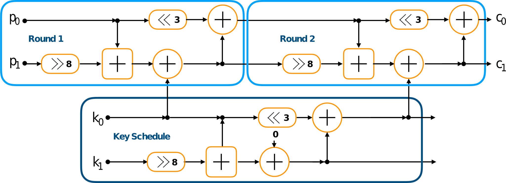

# Speck Cipher Veriog implementation

This repository contains a sample implementation of the SPECK64/128 cipher. 
See [Reference](https://csrc.nist.gov/csrc/media/events/lightweight-cryptography-workshop-2015/documents/papers/session1-shors-paper.pdf).

The cipher is using only ARX (Addition, Rotation and XOR) operations, which can be implemented fast in hardware as well as fast in hardware. 
The cipher can be implemented using two repeated blocks, the key schedule as well as the round function.
Like visualized in the figure below.

The verilog implementation follows this scheme and is subdivided into three verilog modules. 

### Round function

The round function is implemented as a state machine. 
In the following figure the different states of the SPECK verilog implementation can be seen.

#### State:

- 0000: Wait for start signal to start the round function 
- 0001: Assign p0 and p1 to dedicated registers
- 0010: Calculate right shift (>> 8) on p1
- 0011: Calculate p0 + p1
- 0100: Calculate left shift (<< 3) on p0 and p1 XOR subkey k0
- 0101: Calculate p0 = p0 + p1
- 0110: Assign result to ciphertext wire and inidicate round finished by setting finished to 1

### Key schedule

The key schedule is used 